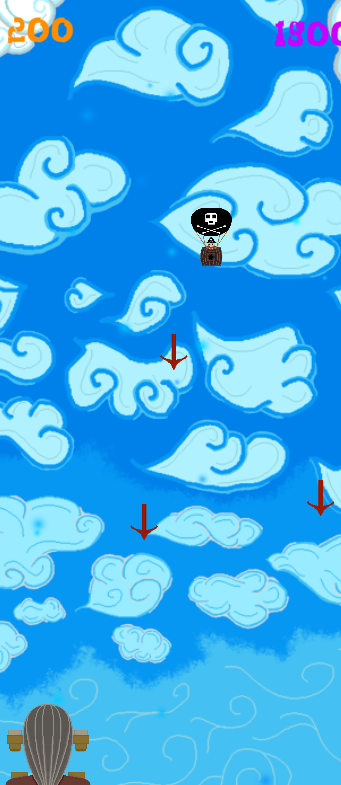

# Air-pirates
Game made in Unity with learning purposes and love of pirates.

## The font used in the game is - [FloodFonts](https://www.dafont.com/pirates-ff.font?text=Air+pirates), piratesblackbeard.ttf

## The sounds effects are taken from https://freesound.org/
    - By Matrixxx
      - https://freesound.org/people/MATRIXXX_/sounds/515801/
      - https://freesound.org/people/MATRIXXX_/sounds/521105/
    - By qubodup
      - https://freesound.org/people/qubodup/sounds/168707/
    - By EFlexMusic
      - https://freesound.org/people/EFlexMusic/sounds/388527/

## The music is taken from https://opengameart.org/
    - By Matthew Pablo - https://opengameart.org/content/blackmoor-tides-epic-pirate-battle-theme

# Screenshots

